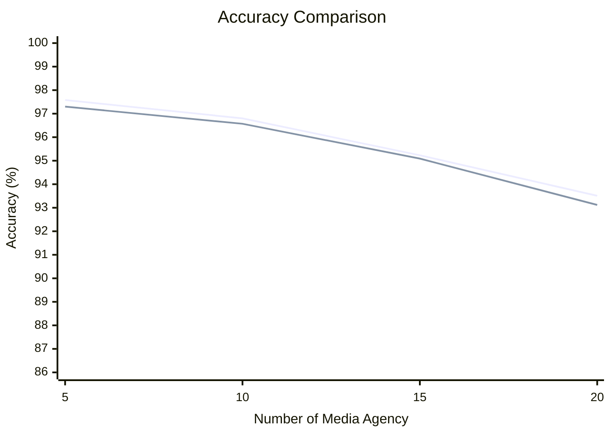

# Phishing-Detection-Accuracy-Comparison
The chart below shows the accuracy comparison between Centralized FL and Decentralized FL.

```mermaid
xychart-beta
    title "Accuracy Comparison"
    x-axis "Number of Media Agency" [5, 10, 15, 20]
    y-axis "Accuracy (%)" 86 --> 100
    line "Centralized FL" [97.58, 96.8, 95.23, 93.51]
    line "Decentralized FL" [97.3, 96.57, 95.09, 93.12]
```
