# Phishing Website Detection Using Machine Learning Classification Algorithms

## Project Overview

This project compares the accuracy performance of different machine learning classification algorithms for phishing website detection. The selected algorithms are Decision Tree, Random Forest, Support Vector Machine, Logistic Regression, and Naive Bayes.

## Accuracy Comparison

The chart below presents the reported accuracy comparison of the selected machine learning algorithms based on related studies.

```mermaid
xychart-beta
    title "Accuracy Comparison of ML Algorithms for Phishing Website Detection"
    x-axis "Machine Learning Algorithms" ["Decision Tree", "Random Forest", "SVM", "Logistic Regression", "Naive Bayes"]
    y-axis "Accuracy (%)" 50 --> 100
    bar "Study 1" [96.0, 97.3, 95.8, 94.2, 93.5]
    bar "Study 2" [96.3, 97.1, 93.9, 92.7, 60.1]
```

## Accuracy Table

| Algorithm | Study 1 Accuracy | Study 2 Accuracy |
|---|---:|---:|
| Decision Tree | 96.0% | 96.3% |
| Random Forest | 97.3% | 97.1% |
| SVM | 95.8% | 93.9% |
| Logistic Regression | 94.2% | 92.7% |
| Naive Bayes | 93.5% | 60.1% |

## Interpretation

Based on the comparison, Random Forest achieved the highest and most consistent accuracy among the selected algorithms. Decision Tree also performed well, while SVM and Logistic Regression showed competitive results. Naive Bayes had lower and less consistent performance, especially in Study 2.

Therefore, Random Forest is considered the most suitable algorithm for the proposed phishing website detection prototype.

## Note

The accuracy values shown are based on related studies and are used for comparison purposes only. Final accuracy results may change once the models are trained and tested using the actual project dataset.
